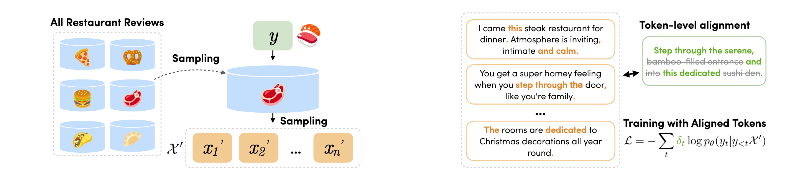

# Noisy Pairing and Partial Supervision for Stylized Opinion Summarization

[]()
[](https://arxiv.org/abs/2211.08723)

This repository contains the dataset reproduction scripts for Noisy Pairing and Partial Supervision for Stylized Opinion Summarization.

<p align="center">
    
<p>


## Citations
```bibtex
@inproceedings{iso2024napa,
    title = "Noisy Pairing and Partial Supervision for Stylized Opinion Summarization",
    author = {Iso, Hayate and Wang, Xiaolan and Suhara, Yoshi},
    booktitle = "INLG",
    year = "2024",
    url = "https://arxiv.org/abs/2211.08723",
}
```


## Setup
- We can install most of the dependencies with the following commands.
```shell
pip install -r requirements.txt
```
- We also need to download the fasttext language identification model to filter out non-English reviews
```shell
wget https://dl.fbaipublicfiles.com/fasttext/supervised-models/lid.176.bin
```

## Dataset
### Yelp dataset
- We can download the Yelp review dataset from this [link](https://www.yelp.com/dataset).
- We will use this review set for the ProSum and FewSum datasets.
- Move the file to data/yelp and uncompress it there.

### Amazon dataset
- We used the publicly available Amazon reviews. Following the previous studies, we used the following four categories of reviews for the experiment: 
```shell
mkdir -r ./data/amazon && cd ./data/amazon
wget -P data/amazon http://snap.stanford.edu/data/amazon/productGraph/categoryFiles/reviews_Clothing_Shoes_and_Jewelry.json.gz
wget -P data/amazon http://snap.stanford.edu/data/amazon/productGraph/categoryFiles/reviews_Electronics.json.gz
wget -P data/amazon http://snap.stanford.edu/data/amazon/productGraph/categoryFiles/reviews_Health_and_Personal_Care.json.gz
wget -P data/amazon http://snap.stanford.edu/data/amazon/productGraph/categoryFiles/reviews_Home_and_Kitchen.json.gz
```

## Pre-processing
- After preparing the raw dataset, we can run the following to obtain the train/dev/test sets.
- Note that with this script, we will obtain the "paired" training set, but it is only used for supervised upperbound settings.
```shell
python ./scripts/prep.py
```
- Using the user-generated raw review dataset and desired style of the summaries, we also create the pseudo-reviews-summary pairs and noisy reviews-summary pairs.
- This script also gives the token-level alignment annotations with a different granularity from word-exact matching to synonym-based matching.
```shell
python ./scripts/build_stem_syn.py
```

# Training

img

## Pre-training with Self-supervision
- We firstly pre-train the opinion summarization system with pseudo-reviews-summary pairs to teach how to summarize the information in the source reviews into a single passage.
```shell
python summarizer.py \
    --train_path ./data/michelin/pseudo.json \
    --default_root_dir ./log/michelin/ss \
    --accumulate_grad_batches 8 \
    --max_steps 100000 \
    --gradient_clip_val 1.0 \
    --model_name facebook/bart-large \
    --precision 16 \
    --gpus 1 
```

## Fine-tuning
- After pre-training the model with self-supervision, we can fine-tune the model with noisy-reviews-summary pairs.
- To do so, we need to specify the self-supervised checkpoint to initialize the model to be fine-tuned.
- For the token alignment we obtained in the pre-processing phase, we can specify the appropriate training dataset for each purpose.
```shell
python summarizer.py \
--train_path ./data/michelin/noisy_syn.json \
--default_root_dir ./log/michelin/noisy_syn_ft \
--ckpt ./log/michelin/ss/lightning_logs/version_0/checkpoints/ \
--accumulate_grad_batches 8 \
--max_steps 2000 \
--gradient_clip_val 1.0 \
--model_name facebook/bart-large \
--precision 16 \
--gpus 1
```

## Generation
- After fine-tuning the model, we can generate the summary with the desired style. In this case, we can generate Michelin-like-summary with the following script:
```shell
python generate.py \
--test_path ./data/michelin/test.json \
--ckpt ./log/michelin/noisy_syn_ft/lightning_logs/version_0/checkpoints/ \
--gpus 1 \
--output_path michelin_noisy-syn_test.txt
```

## Evaluation
- Finally, we can evaluate the quality of the generated summaries based on ROUGE, BERTScore, and CTC scores.
```shell
python evaluate.py \
  ./michelin_noisy-syn_test.txt \
  ./data/michelin/test.json
```
